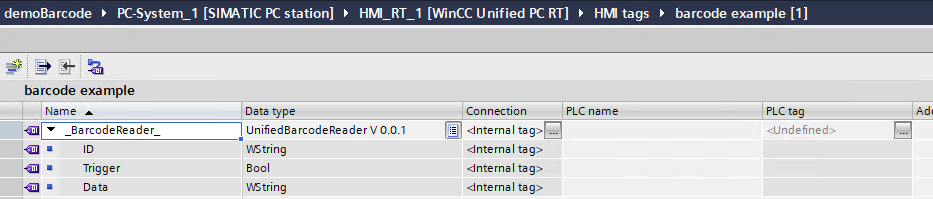
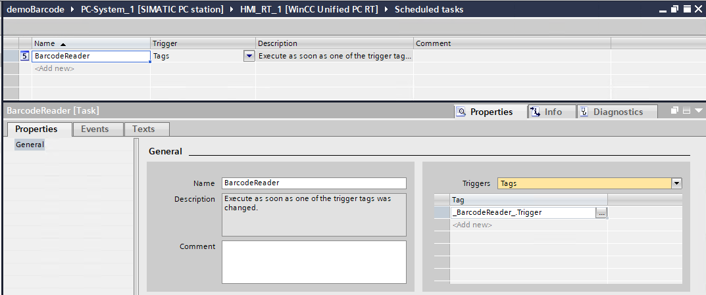
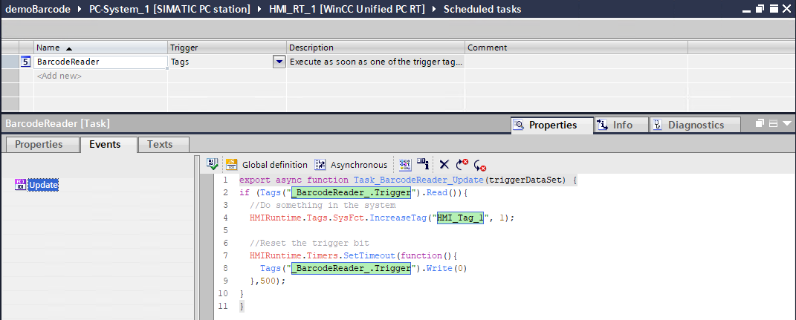

# Unified Barcode Manager
A software in minimized window mode upon machine startup, that listen for a specific hardware ID of the computer and pass the information to the running WinCC Unified PC Runtime, without having to focus a specific field in the Unified application. **Because this program use the ODK of Unified, you must have all the valid licenses on your system in order to have this properly running. If a license if missing on your system, this will prevent the program the communicate with the Unified Runtime.**

**To be able to run the executable, you will need .NET Runtime 8, that you can download it at: [.NET Runtime 8.0.20]([http://example.com](https://dotnet.microsoft.com/en-us/download/dotnet/8.0))

## Installation Steps
1. **Download** the file package `UBM_V1.0.0.zip` from the `Releases` section on the right.
2. **Unzip** the files to any location on the WinCC Unified PC RT station.
3. **Place** the file `UnifiedBarcodeManager.exe startup shortcut` inside the `shell:startup` location (Win+R and then shell:startup)
	- This will start the program upon windows startup, but you can simply launch the shortcut as well
	- It's totally fine to run this program as "minimized"
4. **Configure** the `config.txt` file (that is next to the .exe), you can use `debug=true` to see the hardware id of your scanner, then placing that value next to `specificDeviceId=`. The program looks for this id as the input device. You can leave it empty if you want all the input device to be treated by the program.

## Uninstallation step
1. **Delete** All the related files, there's no "installation", so it's just the files that you have downloaded.

## Steps in TIA Portal
1. **Get** the file `UnifiedBarcodeManager.zal20` from the previously downloaded `UBM_V1.0.0.zip`, inside the examples directory.
2. **Use** the HMI Datatype `UnifiedBarcodeReader` from the Types to create an internal HMI Tag called `_BarcodeReader_`.
4. **Create** a scheduled task with a tag trigger of `_BarcodeReader_.Trigger`.
	- Add the event script to it:
	>> <code>if (Tags("_BarcodeReader_.Trigger").Read()){ //Do something in the system HMIRuntime.Tags.SysFct.IncreaseTag("HMI_Tag_1", 1); //Reset the trigger bit HMIRuntime.Timers.SetTimeout(function(){ Tags("_BarcodeReader_.Trigger").Write(0) },500); }</code>
5. **Replace** the line under `//Do something in the system`, by the action you want to take in your application.

## Tested scope

This has only be tested with `WinCC Unified PC RT V20`.
# Disclaimer:

>  The examples are non-committal and do not lay any claim to completeness with regard to configuration and equipment as well as any eventualities. The examples do not represent any custom-designed solutions but shall offer only support at typical tasks. You are accountable for the proper mode of the described products yourself.
> 
>  These examples do not discharge you from the obligation to safe dealing for application, installation, business and maintenance. By use of these examples, you appreciate that Siemens cannot be made liable for possible damages beyond the provisions regarding described above. We reserve us the right to carry out changes at these examples without announcement at any time. The contents of the other documentation have priority at deviations between the suggestions in these examples and other Siemens publications, such as catalogues  and manuals.
>  > Use at your own risk.
